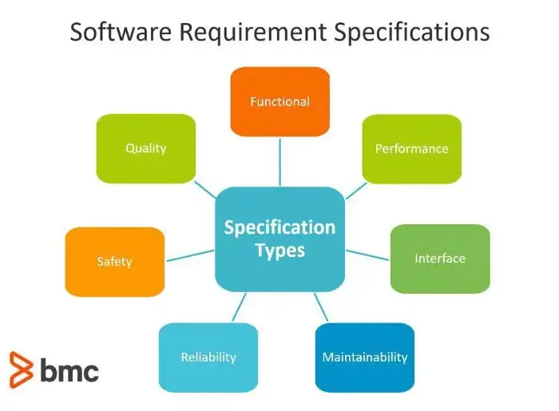

# Erick-s-Teams

## What is the Software Requirements Specification (SRS)? 

A software requirements specification (SRS) is a document explaining how and what the software/system will do. It defines the features and functionality that the product requires to satisfy all stakeholders’ (business, users) needs.

A standard SRS includes:

* A goal/purpose
* A summary of the whole process
* Specific Requirements

The best SRS documents describe how the program communicates with the embedded hardware or specific software with unique coding culture. The chosen real-life users also account for nice SRS documents.

<figure><figcaption>
Image 1.1
</figcaption></figure>

## What does an SRS document contain? 

A **** typical SRS document describes all the software requirements and sometimes even contains a collection of use cases that describe the user interactions needed by the software.

It defines the purpose of a software project, provides the overall definition and specifications of its features.

In general, SRS documents contain three kinds of program requirements:

* _**Functional specifications** that include measures to be performed by the system_
* _**Non-functional**  **requirements** determining the software system’s performance attributes_
* _**Domain requirements** that are device limits on the service domain_

&#x20;  _Components of an SRS_

No two SRS documents are identical because all software projects are different, some using the waterfall development model, and others practicing agile development. However, it is still possible to distill the main components of an SRS and create a rough schematic of what it should look like:

1. Introduction&#x20;

**`-Purpose`**&#x20;

**`-Audience`**&#x20;

**`-Expected use`**&#x20;

**`-Scope -Acronyms and definitions`**

2\. Overview -User needs -Dependencies and Assumptions

3\. System requirements and characteristics -Functional requirements -External interface requirements -System caracteristics -Non-functional requirements

The first section describes the product being developed, its purpose, target audience, intended use, and scope. The second section provides more information on the needs of users and the factors that could prevent the requirements established in the SRS from being met. The last main section is devoted to specific requirements, both functional and non-functional.

Modifiable. An SRS is modifiable if its structure and style are such that any necessary change in the requirement can be made in an easy, complete and coherent way. Changes in an SRS usually require:

Have a coherent and easy-to-use organization, with an index and explicit cross-references.

Do not be redundant; that is, the same requirement should not appear elsewhere in the SRS.

Traceable. An SRS is traceable if the origin of each of its requirements is clear and the reference of each requirement of the future development or improvement documentation is provided. Two types of traceability are recommended:

Backward traceability (that is, to previous stages of development) depends on each requirement explicitly referring to its source in previous documents.

Forward traceability (that is, to all documents generated by the SRS) depends on each SRS requirement having a unique name or reference number.

Usable during the operation and maintenance phase. The SRS must meet the needs of the operation and maintenance phase, including the possible replacement of the software.

Maintenance is usually carried out by personnel not related to the original development. Local changes (corrections) can be applied using a code. However, for the most far-reaching changes, documentation on the design and requirements is essential. This involves two actions:

The SRS must be modifiable

The SRS must contain a record of all the special provisions that apply to the individual components, such as:

His criticality

Their relationship with only temporary needs.

Its origin

This type of knowledge is taken for granted in the development organization, but it is often lacking in the maintenance organization. If the reason or origin of a function is not understood, it is often impossible to perform proper maintenance of the software.
